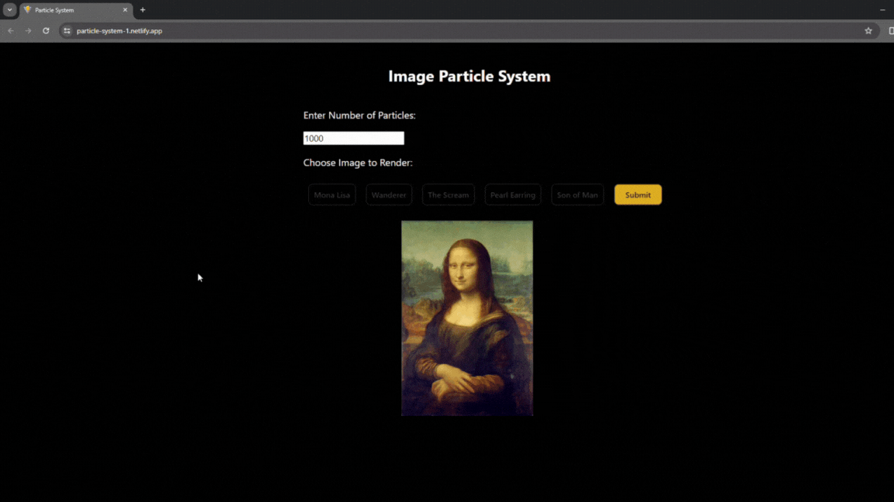

# Particle-System
Link to App: [Particle System](https://particle-system-1.netlify.app/)

A web application with a custom particles system that draws an image the user selected. The program was created using React.js and vanilla Javascript

# Screenshots
